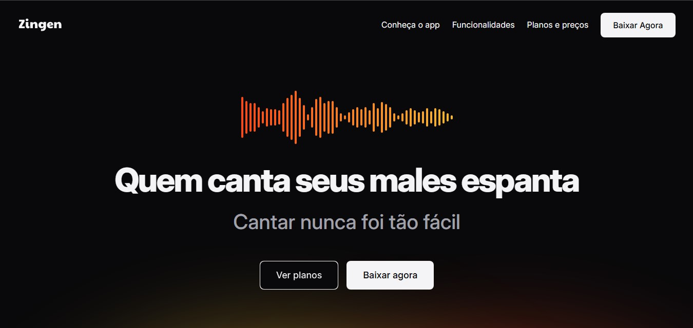

  

# 🎤 Zingen

> Projeto desenvolvido durante o curso **Full-Stack da Rocketseat**, com o objetivo de praticar **HTML** e **CSS** na criação de uma página responsiva.

---

## Estrutura do projeto
Principais arquivos e pastas:

- `index.html` - página principal do projeto
- `index.css` - arquivo principal de estilos
- `assets/` - pasta com imagens e recursos estáticos

---

## 🧠 Tecnologias utilizadas
- HTML5  
- CSS3  